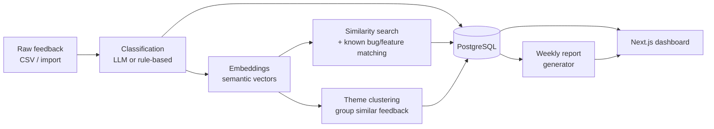

# Welcome to FlowHub AI — Customer Feedback Intelligence Platform

This doc is written for someone joining the project with zero context. It explains what
we're building, why, how it works end to end, and where to look for more detail. It's
intentionally high-level — for exact commands and file paths, jump to `README.md` and
`PROJECT_CONTEXT.md` afterwards.

## 1. What is this, in one paragraph?

Imagine a SaaS company gets hundreds of pieces of customer feedback a week — support
tickets, app store reviews, in-app surveys, emails. Nobody has time to read all of it, so
important signals (a bug affecting many users, a popular feature request, a rising
complaint) get lost. This project builds an AI pipeline that reads that feedback
automatically, figures out what each piece is about, groups similar feedback together,
matches it against known bugs/features, spots recurring themes, and produces a weekly
report a human product manager can act on in five minutes — all shown in a web dashboard.

## 2. The product we're analyzing (it's fictional, on purpose)

We invented a fake SaaS product called **FlowHub** — a project-management / team
collaboration tool, similar to Asana or Trello. It has:

- **8 modules**: Authentication, Dashboard, Task Management, Notifications, Billing,
  Integrations, Reports, Mobile App.
- **6 releases** between Jan–Jul 2026 (`v2.1.0` → `v2.6.0`), each with known bugs and
  shipped features.

Using a fictional product means every piece of feedback is written by us, so we always
know the "correct" answer — which lets us measure how well the AI is actually doing.

## 3. The core problem, broken into steps

Given a pile of raw feedback text, we want to answer:

1. **What kind of feedback is this?** (bug report / feature request / complaint / praise
   / question), which product area does it concern, how urgent, and how does the
   customer feel about it (sentiment)?
2. **Have we seen something like this before?** Find similar feedback, and check if it
   matches an already-known bug or feature request.
3. **What are the big recurring topics right now?** Group feedback into themes (e.g.
   "login keeps failing after the last update") instead of reading item by item.
4. **What should a product manager do this week?** Summarize all of the above into a
   short weekly report with clear, evidence-backed recommendations.
5. **How do people actually see and use this?** A dashboard to browse feedback, themes,
   and reports without touching a terminal.

Each of these is one phase of the build, and each phase is evaluated against a
30-record hand-labeled "gold set" so we know its accuracy, not just that "it runs."

## 4. The end-to-end flow



In plain words: feedback comes in → gets classified → gets embedded into vectors →
those vectors power both similarity/bug-matching and theme clustering → everything is
stored in Postgres → a weekly report engine reads that stored data and writes a
summary → the dashboard displays all of it (raw feedback, themes, reports).

## 5. Feature-by-feature tour (what's actually built)

**1. Synthetic dataset** — ~150 realistic feedback records we wrote ourselves (varied
tone, length, even a few non-English ones and near-duplicates), 30 of which are
manually gold-labeled for evaluation. Dates are auto-regenerated on a rolling 4-week
window ending today, so the demo always looks "current" and week-over-week numbers in
reports are comparable.

**2. Classification** — turns free text into structured fields: feedback type,
category, product module, sentiment, urgency, plus a confidence score and reasoning.
Two versions exist: a free deterministic baseline (VADER + rules, used as a comparison
floor) and a real few-shot LLM classifier (**OpenAI, Anthropic, or Groq**). The LLM
path never spends money by accident — it dry-runs by default, and a real API call
requires an explicit flag plus a cost estimate + confirmation. We've now run it for
real (Groq, then OpenAI `gpt-4o-mini` as the cost-efficient default) — it beats the
rule-based baseline on every field except `product_module` (already near-ceiling), e.g.
sentiment accuracy 0.27 → 0.60. Every run writes a JSON-Lines log (record id, model,
tokens, latency, cache hit) and its results/metrics to Postgres, not CSV files.

**3. Embeddings & retrieval** — converts feedback into 384-dimension vectors locally (no
API cost) using `sentence-transformers`. This powers "find similar feedback" and
"does this match a known bug/feature/release," each with a confidence-style status
(known bug, duplicate feature request, possibly related to a release, brand-new issue,
or no match).

**4. Theme clustering & trends** — groups feedback into topics automatically
(clustering algorithm, not an LLM), names each theme from its keywords, and tracks
whether a theme is new, growing, stable, or declining week over week. Can be
recomputed live from whatever's in the database (`POST /themes/recompute`), not just
from the original offline pipeline run.

**5. Backend API** — a FastAPI + PostgreSQL service that exposes everything above over
HTTP: feedback CRUD + CSV import, run/view classification, similarity & bug-matching
results, theme browsing, weekly reports. All the AI logic lives in one place and the
API just calls it — no duplicated logic.

**6. Weekly reports** — a report that summarizes a date range: totals and
breakdowns, trending themes, matched bugs/features, brand-new issues nobody's tracked
yet, and a handful of rule-based "you should probably look at this" recommendations.
Every number is computed by plain code, never by an LLM — the LLM (if enabled) is only
allowed to write the human-readable narrative text around numbers that already exist,
and it's rejected if it tries to invent or alter a figure.

**7. Dashboard** — a Next.js web app with pages for: Overview (top-line stats), Feedback
Inbox (browse/filter/upload CSV), Feedback Detail (raw text + AI analysis +
similar/matched evidence side by side), Themes, Weekly Reports (generate + read), and
an Evaluation page (shows how accurate the AI actually is against the gold set). A
toggle lets a user pick "Local (free)" vs. "OpenAI API key" processing wherever
analysis or report narratives are triggered — the API option is greyed out with an
explanation if no key is configured server-side, so nothing paid can fire by accident.

**8. Anonymous workspaces (bring-your-own-CSV)** — no login, but every visitor gets a
private `workspace_id` (stored in their browser) so their uploaded data is invisible to
everyone else and never mixes with the shared demo dataset. The home page offers "View
demo" or "Start your own workspace"; the latter walks through upload → a manual
"Process my data" step (free local classification + clustering) → your own dashboard.

## 6. Tech stack, and why we picked each piece

| Layer | Choice | Why |
|---|---|---|
| Classification LLM | OpenAI / Anthropic / Groq (pluggable) | Classifying free text into type/category/sentiment needs real language understanding — rules alone topped out around 0.3–0.4 accuracy. Kept pluggable (not locked to one vendor) so we could swap in Groq for a free/fast trial run, then OpenAI `gpt-4o-mini` as the cheap default once a real key was available. |
| Sentiment baseline | VADER (rule-based) | Free, instant, no API — good enough as a comparison floor to prove the LLM is actually adding value, not just "doing something." |
| Embeddings | `sentence-transformers` (`all-MiniLM-L6-v2`) | Runs fully locally, no per-call cost, small (384-dim) and fast enough for similarity search and clustering over hundreds of records. |
| Clustering | scikit-learn (agglomerative clustering) | Deterministic and free — grouping similar feedback into themes doesn't need an LLM once we already have embeddings; a classic clustering algorithm does it reproducibly. |
| Backend API | FastAPI + Pydantic | Async-friendly, automatic request validation and OpenAPI docs, and a natural fit for a Python codebase that already had the AI pipeline in Python — no separate service/language to maintain. |
| Database | PostgreSQL + `pgvector` | One database for both normal relational data (feedback, themes, reports) *and* vector similarity search, instead of running a separate vector database alongside Postgres. |
| ORM / migrations | SQLAlchemy + Alembic | Versioned, reviewable schema changes (every table added — `reports`, `evaluation_runs`, `workspace_id` — has its own migration file) instead of hand-editing a live database. |
| Frontend | Next.js + TypeScript + Tailwind + Recharts | Next.js's App Router gives us pages + API routes in one project; TypeScript catches mismatches with the backend's typed responses; Tailwind and Recharts get a decent-looking dashboard with charts up quickly without a design system from scratch. |
| Packaging/infra | Docker Compose | One command brings up Postgres + backend (+ frontend) consistently on any machine — no "works on my machine" setup drift. |

Guiding rule behind every choice above: **prefer deterministic/local tools, and reach
for an LLM only where rules genuinely can't do the job** (see the philosophy below) —
that's why VADER/embeddings/clustering are all free-and-local, while only
classification and report narration touch a paid API, and even then only when
explicitly enabled.

## 7. Why things were built this way (the philosophy)

- **Local-first, LLM only where it earns its keep.** Anything that can be done
  deterministically (sentiment baseline, embeddings, clustering, all report math) is —
  cheaper, faster, reproducible. The LLM is reserved for classification and writing
  prose, where rules genuinely can't do the job.
- **No data leakage.** The fields we're trying to predict (sentiment, category, etc.)
  are never fed back into the model as input — enforced in code, not just by
  convention, with tests proving it.
- **Cost safety by default.** Every LLM-calling code path defaults to a free "dry run"
  and requires an explicit opt-in, cost estimate, and confirmation before spending real
  money.
- **Evaluate everything.** Every phase — classification, retrieval, clustering,
  reports — is scored against the hand-labeled gold set, with known failure modes
  documented, not swept under the rug.
- **Build incrementally.** Each phase had to work and be evaluated standalone before
  the next one was allowed to depend on it (dataset → classify → retrieve → cluster →
  API/DB → reports → dashboard).
- **Isolate by workspace, not by account.** Anonymous, header-based `workspace_id`
  scoping keeps "bring your own data" simple (no auth system to build) while still
  guaranteeing one visitor's upload never leaks into another's view or the shared demo.

## 8. Where things stand today

**v1 is complete** (Phases 1–7, frozen as of 2026-07-21): the entire pipeline above
works end to end, from raw feedback to a browsable dashboard.

**Since the freeze**, a few iterations landed on top of v1 without reopening it:
anonymous workspaces / bring-your-own-CSV, real LLM providers wired up and run for
real (Groq, then OpenAI), JSON-Lines logging + Postgres storage for every
classification run, and a demo-reset script that keeps the sample dataset on a fresh
rolling 4-week window. See `docs/changelog/0015`–`0018` for details.

**Explicitly not built yet (v2)**, by deliberate decision, not oversight:

- Background job processing (Celery + Redis) — reports/analysis currently run
  synchronously.
- A human-correction feedback loop (letting a person fix a wrong AI label and having
  that improve future evaluation).
- Real authentication (today's "workspace" is anonymous/local-storage-based, not a
  login system).
- Scheduled/automatic report generation (today it's generate-on-demand).
- CI/CD and production deployment hardening.

## 9. How to run it (short version — see `README.md` for full detail)

```bash
# Backend + database
docker compose up -d db
cd backend && python3 -m venv .venv && source .venv/bin/activate
pip install -r requirements.txt
alembic upgrade head
python3 scripts/import_data.py     # loads the existing sample dataset
uvicorn app.main:app --reload --port 8001

# Frontend (separate terminal)
cd frontend && npm install && cp .env.example .env.local
npm run dev                        # http://localhost:3000
```

## 10. Where to go next

- `README.md` — exact run commands and repo layout.
- `PROJECT_CONTEXT.md` — the detailed, up-to-date snapshot of every phase (read this
  before making any change).
- `docs/project_plan.md` — the original roadmap and what's deferred to v2, and why.
- `docs/changelog/` — one dated doc per notable change, with full what/why/how.
- `backend/README.md` / `frontend/README.md` — service-specific setup, endpoints, and
  test commands.

If you only read one other file after this one, make it `PROJECT_CONTEXT.md`.
